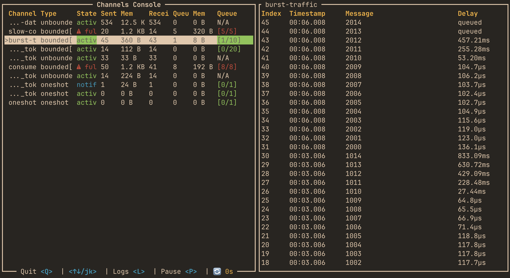

# channels-console 
[](https://crates.io/crates/channels-console) [](https://github.com/pawurb/channels-console/actions)

**The codebase has been integrated into [hotpath](https://github.com/pawurb/hotpath). Further updates and enhancements will continue in the new repository.**


A lightweight, easy-to-use tool for real-time visibility into your Rust channels and streams. Inspect live message contents and observe how channels interact to better understand data flow. Track queue depth, delay, throughput, and memory usage to spot channel-related issues.

Supports [std::sync](https://doc.rust-lang.org/stable/std/sync/mpsc/index.html), [Tokio](https://github.com/tokio-rs/tokio), [futures-rs](https://github.com/rust-lang/futures-rs), and [crossbeam](https://github.com/crossbeam-rs/crossbeam) channels, plus any type implementing the [futures::Stream](https://docs.rs/futures/latest/futures/stream/trait.Stream.html) trait.

## Features

- **Zero-cost when disabled** — fully gated by a feature flag
- **Minimal configuration** - just one `channel!` or `stream!` macro to start collecting metrics
- **Detailed stats** - per channel/stream status, sent/received messages, queue capacity, and memory usage
- **Background processing** - minimal profiling impact
- **Live monitoring** - view metrics in a clear, real-time TUI dashboard (built with [ratatui.rs](https://ratatui.rs/))

## Getting started

`Cargo.toml`

```toml
channels-console = { version = "0.3", optional = true, features=['tokio', 'futures', 'crossbeam'] }

[features]
channels-console = ["dep:channels-console"]
```

This config ensures that the lib has **zero** overhead unless explicitly enabled via a `channels-console` feature.

[std::sync](https://doc.rust-lang.org/stable/std/sync/mpsc/index.html) channels can be instrumented by default. Enable `tokio`, `futures`, or `crossbeam` features for [Tokio](https://github.com/tokio-rs/tokio), [futures-rs](https://github.com/rust-lang/futures-rs), and [crossbeam](https://github.com/crossbeam-rs/crossbeam) channels, respectively.

### Instrumenting Channels

Use the `channel!` macro to monitor selected channels:

```rust
let (tx1, rx1) = tokio::sync::mpsc::channel::<i32>(10);
#[cfg(feature = "channels-console")]
let (tx1, rx1) = channels_console::channel!((tx1, rx1));

let (mut txb, mut rxb) = futures_channel::mpsc::channel::<i32>(10);
#[cfg(feature = "channels-console")]
let (mut txb, mut rxb) = channels_console::channel!((txb, rxb), capacity = 10);
```

Futures and `std::sync` bounded channels don't provide an API exposing their size, so you have to provide `capacity` to the `channel!` macro.

### Instrumenting Streams

Use the `stream!` macro to monitor any type implementing the `Stream` trait:

```rust
use futures::stream::{self, StreamExt};

let s = stream::iter(1..=10);
#[cfg(feature = "channels-console")]
let s = channels_console::stream!(s, label = "my-stream");

let items: Vec<_> = s.collect().await;
```

This is the only change you have to do in your codebase. Both macros return exactly the same types so they remain 100% compatible.

Now, install `channels-console` TUI:

```bash
cargo install channels-console --features=tui
```

Execute your program with `--features=channels-console`:

```bash
cargo run --features=channels-console
```

In a different terminal run `channels-console` CLI to start the TUI and see live usage metrics:

```bash
channels-console
```



### Quickstart demo guide

1. Install CLI:

```bash
cargo install channels-console --features=tui
```

2. Clone this repo:

```bash
git clone git@github.com:pawurb/channels-console.git
```

3. Run `console_feed` example:

```bash
cd channels-console
cargo run --example console_feed_tokio --features=channels-console
```

4. Run TUI (in a different terminal):

```bash
channels-console
```

## How it works?

The `channel!` macro wraps channels with lightweight proxies that transparently forward all messages while collecting real-time statistics. Each `send` and `recv` operation passes through a monitored proxy channel that emits updates to a background metrics system.

The `stream!` macro wraps streams and tracks items as they are yielded, collecting statistics about throughput and completion.

In the background, an HTTP server process exposes gathered metrics in a JSON format, allowing the TUI process to display them in the interface.

### A note on accuracy

`channels-console` instruments proxy channels that wrap your actual channel instances. It observes messages as they pass through these proxies rather than when they are finally consumed. As a result, the displayed metrics are an approximation of real channel activity - useful for debugging and diagnosing flow issues, but not a 100% accurate source of truth for production monitoring.

Because of this proxy design, each bounded channel is effectively represented by three layers - the outer proxy, the original channel, and the inner proxy. In practice, this triples the total buffering capacity. For the same reason, it's currently not possible to measure the queue size of unbounded channels. Even with a slow consumer, the intermediate proxies will immediately absorb all incoming messages, masking true backlog behavior.

That said, since the proxy layer introduces virtually no overhead compared to direct channel usage, timing and delay metrics should remain accurate. Logged messages contents and ordering is also 100% accurate. 

Current design intentionally sacrifices accuracy for the ease of integration - you can instrument channels with minimal code changes and still get meaningful visibility into their behavior.

### There be bugs 🐛

This library has just been released. I've tested it with several apps, [big](https://x.com/_pawurb/status/1986570325341962339) and small, and it consistently produced reliable metrics. However, please note that enabling monitoring can subtly affect channel behavior in some cases. For example, using `try_send` may not return an error as expected, since the proxy layers effectively increase total capacity. I'm actively improving the library, so any feedback, issues, bug reports are appreciated.

## API

### Supported Channel Types

#### `std::sync` Channels
- [`std::sync::mpsc::channel`](https://doc.rust-lang.org/std/sync/mpsc/fn.channel.html) 
- [`std::sync::mpsc::sync_channel`](https://doc.rust-lang.org/std/sync/mpsc/fn.sync_channel.html) 

#### Tokio Channels
- [`tokio::sync::mpsc::channel`](https://docs.rs/tokio/latest/tokio/sync/mpsc/fn.channel.html) 
- [`tokio::sync::mpsc::unbounded_channel`](https://docs.rs/tokio/latest/tokio/sync/mpsc/fn.unbounded_channel.html) 
- [`tokio::sync::oneshot::channel`](https://docs.rs/tokio/latest/tokio/sync/oneshot/fn.channel.html) 

#### Futures Channels
- [`futures_channel::mpsc::channel`](https://docs.rs/futures-channel/latest/futures_channel/mpsc/fn.channel.html)
- [`futures_channel::mpsc::unbounded`](https://docs.rs/futures-channel/latest/futures_channel/mpsc/fn.unbounded.html)
- [`futures_channel::oneshot::channel`](https://docs.rs/futures-channel/latest/futures_channel/oneshot/fn.channel.html)

#### Crossbeam Channels
- [`crossbeam_channel::bounded`](https://docs.rs/crossbeam/latest/crossbeam/channel/fn.bounded.html)
- [`crossbeam_channel::unbounded`](https://docs.rs/crossbeam/latest/crossbeam/channel/fn.unbounded.html)

#### Streams
- Any type implementing [`futures_util::Stream`](https://docs.rs/futures/latest/futures/stream/trait.Stream.html)

_I'm planning to support more channel types. PRs are welcome!_

### `channel!` Macro

The `channel!` macro is the primary way to monitor channels. It wraps channel creation expressions and returns instrumented versions that collect metrics.

**Basic Usage:**

```rust
use tokio::sync::mpsc;

#[tokio::main]
async fn main() {
    // Create channels normally
    let (tx, rx) = mpsc::channel::<String>(100);

    // Instrument them only when the feature is enabled
    #[cfg(feature = "channels-console")]
    let (tx, rx) = channels_console::channel!((tx, rx));

    // The channel works exactly the same way
    tx.send("Hello".to_string()).await.unwrap();
}
```

**Zero-Cost Abstraction:** When the `channels-console` feature is disabled, the `#[cfg]` attribute ensures the instrumentation code is completely removed at compile time - there's absolutely zero runtime overhead.

**Note:** The first invocation of `channel!` automatically starts:
- A background thread for metrics collection
- An HTTP server on `http://127.0.0.1:6770` (default port) exposing metrics in JSON format

This initialization happens only once and is shared across all instrumented channels.

**Channel Labels:**

By default, channels are labeled with their file location and line number (e.g., `src/worker.rs:25`). You can provide custom labels for easier identification:

```rust
let (tx, rx) = mpsc::channel::<Task>(10);
#[cfg(feature = "channels-console")]
let (tx, rx) = channels_console::channel!((tx, rx), label = "task-queue");
```

**Capacity Parameter Requirement:**

⚠️ **Important:** For `std::sync::mpsc` and `futures::channel::mpsc` **bounded channels**, you **must** specify the `capacity` parameter because their APIs don't expose the capacity after creation:

```rust
use std::sync::mpsc;

// std::sync::mpsc::sync_channel - MUST specify capacity
let (tx, rx) = mpsc::sync_channel::<String>(10);
#[cfg(feature = "channels-console")]
let (tx, rx) = channels_console::channel!((tx, rx), capacity = 10);
```

```rust
use futures_channel::mpsc;

// futures bounded channel - MUST specify capacity
let (tx, rx) = mpsc::channel::<String>(10);
#[cfg(feature = "channels-console")]
let (tx, rx) = channels_console::channel!((tx, rx), capacity = 10);
```

Tokio and crossbeam channels don't require the capacity parameter because their capacity is accessible from the channel handles. 

**Message Logging:**

By default, instrumentation only tracks message timestamps. To capture the actual content of messages for debugging, enable logging with the `log = true` parameter (the message type must implement `std::fmt::Debug`):

```rust
use tokio::sync::mpsc;

let (tx, rx) = mpsc::channel::<String>(10);
#[cfg(feature = "channels-console")]
let (tx, rx) = channels_console::channel!((tx, rx), log = true);
```

### `stream!` Macro

The `stream!` macro allows you to monitor any type implementing the `futures::Stream` trait:

**Basic Usage:**

```rust
use futures_util::stream::{self, StreamExt};

#[tokio::main]
async fn main() {
    // Create a stream
    let stream = stream::iter(1..=10);

    // Instrument it
    #[cfg(feature = "channels-console")]
    let stream = channels_console::stream!(stream);

    // Use it normally
    let items: Vec<_> = stream.collect().await;
}
```

**Stream Labels:**

Like channels, streams can be labeled for easier identification:

```rust
let stream = stream::iter(1..=10);
#[cfg(feature = "channels-console")]
let stream = channels_console::stream!(stream, label = "number-stream");
```

**Message Logging:**

Capture the actual content of yielded items (requires `Debug` trait on the item type):

```rust
let stream = stream::iter(vec!["hello", "world"]);
#[cfg(feature = "channels-console")]
let stream = channels_console::stream!(stream, log = true);
```

**What's Tracked:**

For streams, the instrumentation tracks:
- **Yielded** - Total number of items produced by the stream
- **State** - Whether the stream is active or completed (returned `None`)
- **Item Logs** - Optional Debug representation of yielded items (when `log = true`)

**Note:** Unlike channels, streams don't have concepts like "queue depth" or "sent vs received" - they only yield items. 

### `ChannelsGuard` - Printing Statistics on Drop

Similar to the [hotpath API](https://github.com/pawurb/hotpath) the `ChannelsGuard` is a RAII guard that automatically prints channel statistics when dropped (typically at program end). This is useful for debugging and getting a summary of channel usage.

**Basic Usage:**

```rust
use tokio::sync::mpsc;

#[tokio::main]
async fn main() {
    // Create guard at the start of your program (only when feature is enabled)
    #[cfg(feature = "channels-console")]
    let _guard = channels_console::ChannelsGuard::new();

    // Your code with instrumented channels...
    let (tx, rx) = mpsc::channel::<i32>(10);
    #[cfg(feature = "channels-console")]
    let (tx, rx) = channels_console::channel!((tx, rx));

    // ... use your channels ...

    // Statistics will be printed when _guard is dropped (at program end)
}
```

**Output Formats:**

You can customize the output format using `ChannelsGuardBuilder`:

```rust
#[tokio::main]
async fn main() {
    #[cfg(feature = "channels-console")]
    let _guard = channels_console::ChannelsGuardBuilder::new()
        .format(channels_console::Format::Json)
        .build();
}
```

**Output Example (Table Format):**

```
=== Channel Statistics (runtime: 5.23s) ===

+------------------+-------------+--------+------+-------+----------+--------+-------+
| Channel          | Type        | State  | Sent | Mem   | Received | Queued | Mem   |
+------------------+-------------+--------+------+-------+----------+--------+-------+
| task-queue       | bounded[10] | active | 1543 | 12 KB | 1543     | 0      | 0 B   |
| http-responses   | unbounded   | active | 892  | 89 KB | 890      | 2      | 200 B |
| shutdown-signal  | oneshot     | closed | 1    | 8 B   | 1        | 0      | 0 B   |
+------------------+-------------+--------+------+-------+----------+--------+-------+
```

## Configuration

### Metrics Server Port

The HTTP metrics server runs on port `6770` by default. You can customize this using the `CHANNELS_CONSOLE_METRICS_PORT` environment variable:

```bash
CHANNELS_CONSOLE_METRICS_PORT=8080 cargo run --features channels-console
```

When using the TUI console, specify the matching port with the `--metrics-port` flag:

```bash
channels-console --metrics-port 8080
```
